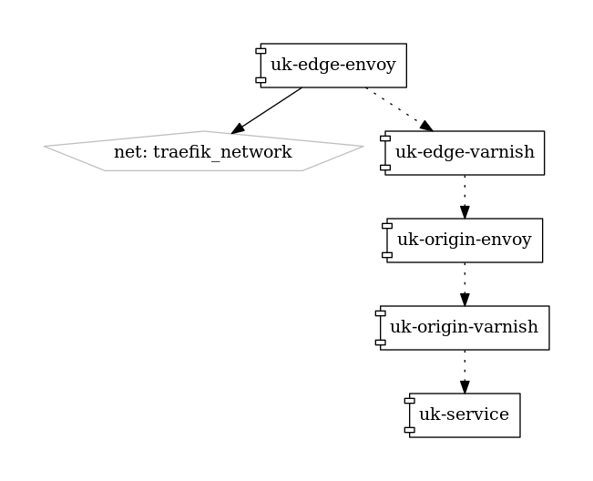

# envoy-varnish-ha-layer (EVHA)

## Goal

Highly avaliable n-tier varnish cache using envoy tracing to analyse functional behaviour such that we ca recognise impact of varnish cluster structure changes and cache clearing events against backend service.

 

## Useful things

https://github.com/pmsipilot/docker-compose-viz